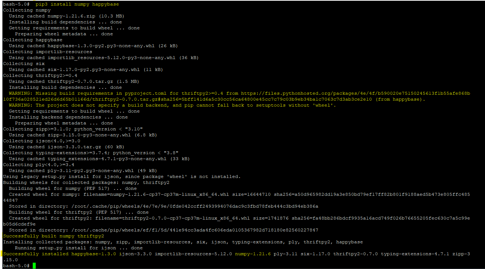
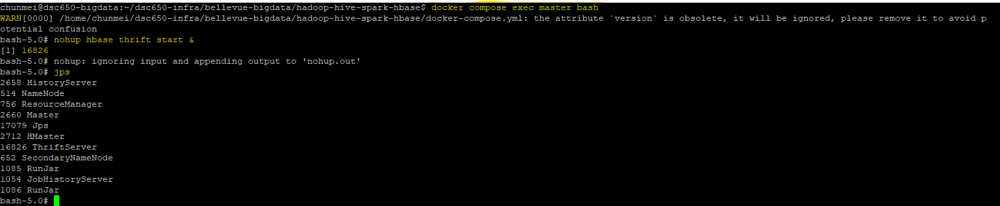

# Project Summary

## Implementation Overview

Summarize the end-to-end project in your own words.

Describe the dataset, the purpose of the pipeline, and how the major technologies work together:

**Source Data → NiFi → HDFS → Hive → Spark MLlib → HBase**

Spark execution is submitted through **YARN**.

## Dataset

**Dataset name:** branch_growth    
**GitHub direct URL:** https://raw.githubusercontent.com/MAYRUAN/big-data-architecture-project/refs/heads/main/dsc650-big-data-portfolio-starter-main/sample-data/branch_growth.csv  

Briefly explain what the dataset contains and why it is appropriate for the selected Spark MLlib workflow.  

The branch_growth dataset captures branch-level financial and operational metrics across four attributes: Branch_ID, Region, Ad_Budget_K (advertising budget in thousands), and New_Accnts_Opened (new accounts acquired).  

It is ideal for Spark MLlib workflows—specifically linear or polynomial regression—for the following reasons:  

**Clear Feature-Target Relationship:** Ad_Budget_K serves as a direct numeric predictor, while New_Accnts_Opened is a continuous target variable suitable for predictive modeling.  
**Categorical Feature Engineering:** The Region attribute provides an ideal field for Spark MLlib feature pipelines, such as string indexing (StringIndexer) and one-hot encoding (OneHotEncoder), to evaluate localized growth patterns.  
**Distributed Scalability:** The structured, numeric-heavy schema translates cleanly into Spark VectorAssembler pipelines, demonstrating end-to-end feature extraction and model training across a distributed cluster.  

## Environment Setup

Document the supporting environment configuration required by the project.

Explain why the required Python libraries (for example, `numpy` and `happybase`) are needed and why the HBase Thrift server must be running for the Spark-to-HBase portion of the pipeline.

**Required Python Libraries**  

**happybase:** Acts as the Python client interface for HBase, enabling direct connection, table creation, and record insertion via standard Python syntax.  

**numpy:** Supplies high-performance numerical data structures and underlying array handling required by downstream analytical pipelines and PySpark transformations.  

**Role of the HBase Thrift Server**  
HBase is built natively in Java and communicates via custom Java RPCs. The Thrift server acts as a cross-language API gateway (listening on port 9090) that translates non-Java Python/happybase calls into native HBase operations. It must be running for PySpark drivers and scripts to establish connections and write streaming/batch data to HBase tables.  

### Package Installation Evidence

### HBase Thrift Server Evidence

## What Worked

Summarize the major portions of the pipeline that executed successfully.

## Issues & Challenges Encountered

Describe the most meaningful technical problems encountered while building the project.

For each important challenge, explain:

1. what happened;
2. how you investigated it;
3. what you changed or fixed;
4. what you learned from the issue.

## Results

Summarize the final technical results, including the successful movement of data through the pipeline and the machine learning results produced by Spark MLlib.

## Lessons Learned

Describe the most important technical lessons gained from integrating multiple distributed services in one environment.

## Production Considerations

Explain what you would change if this architecture were being deployed as a production system.

Possible areas to consider include:

- security and authentication;
- high availability;
- observability and monitoring;
- resource sizing;
- automation and CI/CD;
- data governance;
- secrets management;
- scalability and fault tolerance.
