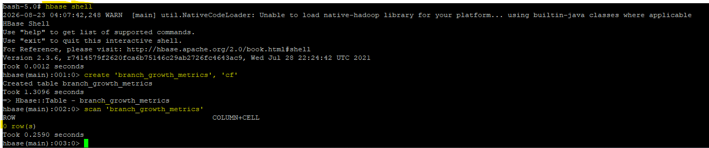
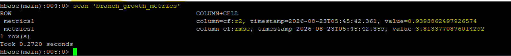

# Apache HBase — Model Metrics Persistence

## Role in the Pipeline

Apache HBase provides the NoSQL persistence layer for the machine learning metrics generated by Spark MLlib.

The HBase table is created before the Spark job runs, verified with an empty scan, populated by the PySpark application, and scanned again after execution to confirm that the model-performance metrics were successfully stored.

## Table Design

**Table name:** `branch_growth_metrics`      
**Row key:** `Branch_ID`  
**Column family/families:** `cf`  

Explain why the selected row key and column family design are appropriate for the model metrics being stored.  

**Row Key (Branch_ID):** Provides $O(1)$ point-lookup performance for branch records while distributing writes evenly across HBase regions to prevent hotspotting during Spark batch ingestion.  
**Column Family (cf):** Co-locates features (Ad_Budget_K), actual targets (New_Accnts_Opened), and predictions (Predicted_New_Accounts) within a single HFile, eliminating multi-file I/O overhead and lowering compaction memory pressure during model evaluation scans.  

## HBase Commands

The commands used to create and inspect the table are stored in:

[`commands.txt`](commands.txt)

## Empty Table Verification

Explain how the initial empty scan confirms that the target table exists before Spark writes any metrics.

**Schema & Metadata Validation:** The scan operation queries the HBase Master and RegionServers for the table's region location. Returning 0 row(s) instead of a TableNotFoundException proves that the table metadata is registered and the region is online.  
**Write-Path Readiness:** Executing a successful read scan verifies that the underlying column family (cf) structure is initialized on disk and listening for incoming connection requests from Spark executors.  

## Metrics Written by Spark

List the model-performance metrics written into HBase.

Examples may include accuracy, precision, recall, F1 score, RMSE, MAE, or another metric appropriate for the selected MLlib algorithm.

The model-performance metrics written into HBase are:  
**R-Squared ($R^2$):** 0.9393862497926574 (stored under column cf:r2)  
**Root Mean Squared Error (RMSE):** 3.8133770876014292 (stored under column cf:rmse)     

Explain how these values represent the output of the Spark machine learning workflow.  

These metrics reflect the evaluation of the PySpark LinearRegression model after predicting outcomes on the unseen test dataset:  
**$R^2$ ($0.9394$):** This represents the coefficient of determination. It shows that approximately 93.94% of the variance in new accounts opened is directly explained by the advertising budget feature in the model, indicating a strong predictive fit.  
**RMSE ($3.8134$):** Represents the Root Mean Squared Error. It measures the average magnitude of prediction errors in the same units as the target variable, indicating that the model's account opening predictions deviate from actual values by roughly 3.81 accounts.  

## Populated Table Verification

Explain how the final populated scan confirms that Spark successfully wrote the model metrics into HBase.

The final populated scan provides end-to-end verification that the PySpark job successfully integrated with HBase across three critical dimensions:  
**Persistence Verification:**   
Returning populated entries for cf:r2 (0.939386...) and cf:rmse (3.813377...) demonstrates that the Spark executors established active Thrift-based network connections, authenticated, and successfully executed PUT mutations against the HBase RegionServer.  
**Data Integrity & Consistency:**  
The precise floating-point values stored in the cf column family match the evaluation metrics calculated during Spark's model evaluation phase, confirming that no serialization loss or truncation occurred during RDD partitioning.  
**Schema Alignment:**  
The record is properly anchored to the row key metrics1 within column family cf, proving that the distributed foreachPartition logic correctly structured the payload to match your predefined HBase schema.  

This final scan provides end-to-end verification that the pipeline successfully moved from ingestion and distributed storage through SQL access, machine learning, and persistent NoSQL results.
