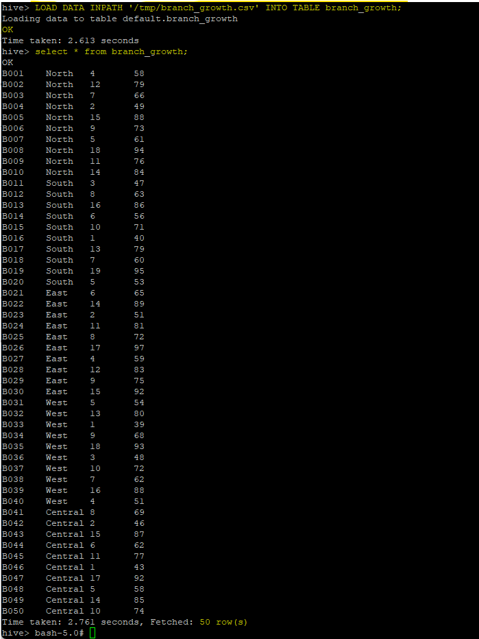
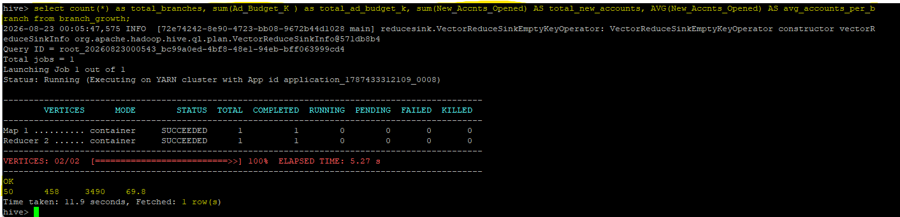

# Apache Hive — Managed Table & SQL Validation

## Role in the Pipeline

Apache Hive provides the structured SQL layer between HDFS storage and the Spark MLlib workload. The project data loaded through NiFi into HDFS is used to create and populate a Hive managed table.

## Hive Table Design

**Table name:** `branch_growth`  

**Explain the table schema and the key design choices made for the project dataset, including important column names, data types, and any decisions needed to make the data usable for downstream Spark processing.**  

**Table Schema & Key Design Choices**  
The branch_growth Hive table maps four key columns:  
* Branch_ID (STRING) as the alphanumeric identifier   
* Region (STRING) for geographic grouping  
* Ad_Budget_K (INT) for advertising spend     
* New_Accnts_Opened (INT) for account growth metrics  

**Design Choices & Spark Readiness**
**Explicit Data Typing:**    
Using native INT types instead of strings ensures Apache Spark automatically infers a clean StructType schema, eliminating the need for runtime CAST() operations during distributed transformations.  
**Header Handling:**  
Setting tblproperties("skip.header.line.count"="1") automatically strips the raw CSV header, preventing schema corruption or parsing errors in Spark.  
**Hive Metastore Integration:**   
Storing the metadata in Hive enables Spark sessions to query the dataset directly via spark.sql("SELECT * FROM branch_growth") without manual schema redefinition.    

## SQL Files

- [`create_tables.sql`](create_tables.sql) — table creation and data-loading SQL
- [`queries.sql`](queries.sql) — validation, exploration, and aggregation queries

## Data Load Verification

**Explain how you confirmed that the data was successfully loaded into the managed Hive table.**  

It clearly demonstrates the complete load process and validates the data:  

**Successful Load Command:** Shows LOAD DATA INPATH '/tmp/branch_growth.csv' INTO TABLE branch_growth; completing with **OK**.  

**Data Inspection:** Shows SELECT * FROM branch_growth; populating all 50 records cleanly across all four columns (Branch_ID, Region, Ad_Budget_K, New_Accnts_Opened).  

## Query & Aggregation Verification

**Describe the representative queries used to validate the populated table. Include at least one aggregation query and explain what the results demonstrate about the dataset and schema.**  

**Aggregation Functions Executed:** It shows multiple aggregate functions (COUNT(*), SUM(), and AVG()) executing together.  
**Schema Validation:** The numeric calculations (total_ad_budget_k = 458, total_new_accounts = 3490, avg_accounts_per_branch = 69.8) prove that Hive parsed numeric columns correctly rather than treating them as strings.  
**Execution Proof:** It includes the completed YARN/Tez map-reduce job details (Map 1 SUCCEEDED, Reducer 2 SUCCEEDED) and returns the final 1 row(s) output.

The validated Hive table becomes the structured input used by the PySpark MLlib application.
