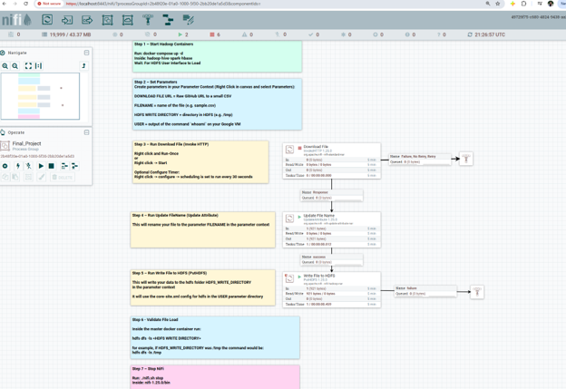
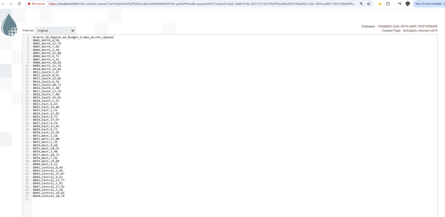
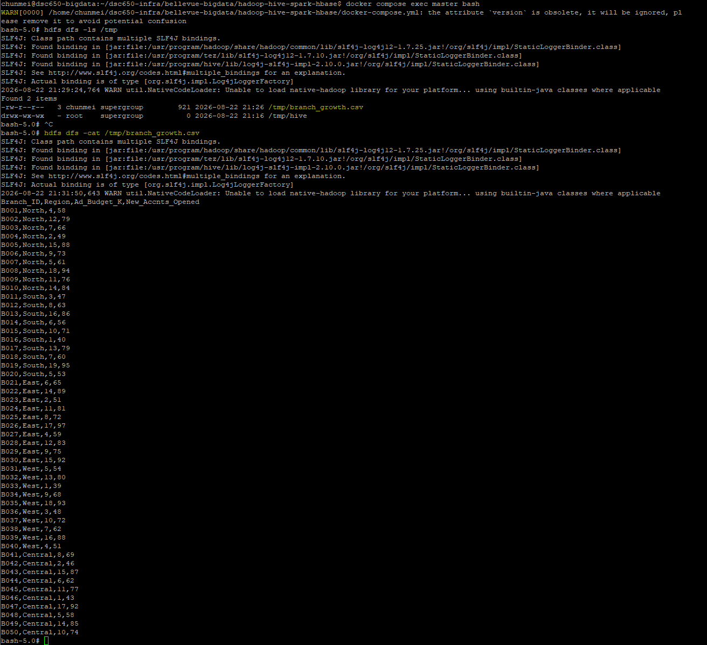

# Apache NiFi — Data Ingestion into HDFS

## Role in the Pipeline

Apache NiFi provides the ingestion and orchestration layer for this project. The completed flow retrieves the project dataset and writes it into HDFS for downstream processing.

## Source Dataset

**Dataset:** branch_growth.csv  
**GitHub direct URL:** https://raw.githubusercontent.com/MAYRUAN/big-data-architecture-project/refs/heads/main/dsc650-big-data-portfolio-starter-main/sample-data/branch_growth.csv  

**Briefly describe what the dataset contains and why it was selected.**  

The branch_growth.csv dataset contains operational metrics for 50 distinct business branches (B001 through B050) across five key geographic regions (North, South, East, West, Central). For each branch, it tracks two primary quantitative variables:  
**Ad_Budget_K:** The local advertising expenditure measured in thousands of dollars.  
**New_Accnts_Opened:** The volume of new customer accounts acquired.  

**Why It Was Selected:**

**Evaluates Marketing Efficiency**: Provides structured numeric data to analyze the direct correlation between local advertising spend and new account acquisition.  
**Regional Benchmarking**: Enables comparative performance analysis across different geographic territories to identify high-performing regional strategies.  
**Predictive Modeling Ready**: Serves as a clean, continuous dataset ideal for demonstrating core data analysis techniques, including regression analysis, performance forecasting, and ROI visualization.  

## Flow Design

Describe the important processors used in the final NiFi flow and the role each processor performs.

| Processor / Process Group | Role in the Flow |
|---|---|
| Download File (InvokeHTTP) | Fetches the raw dataset file from the source URL via an HTTP GET request and passes the downloaded content downstream as a FlowFile. |
| Update File Name (UpdateAttribute) | Modifies the metadata attributes of the incoming FlowFile, setting a specific or standardized target filename before writing it to storage. |
| Write File to HDFS (PutHDFS) | Writes the final FlowFile content directly into the Hadoop Distributed File System (HDFS) destination path. |

**Explain how data moves from the source URL through NiFi and into HDFS.**  

Data flows through the Apache NiFi pipeline via three core processing stages:  

**Ingestion**: The Download File processor (InvokeHTTP) initiates an HTTP GET request to fetch the raw dataset directly from the source URL and packages the payload into a FlowFile upon a successful response.    
**Metadata Transformation**: The FlowFile passes to the Update File Name processor (UpdateAttribute), which modifies the file's attributes to assign a standardized filename before it is committed to storage.  
**Storage Ingestion**: The Write File to HDFS processor (PutHDFS) takes the processed FlowFile and streams its contents into the Hadoop Distributed File System (HDFS) target directory.  

## HDFS Destination

**HDFS path:** `/tmp/branch_growth.csv`

**Explain where NiFi writes the dataset and how the destination is used by the next stage of the pipeline.**  

Apache NiFi's PutHDFS processor writes the ingested and renamed dataset directly into the Hadoop Distributed File System at /tmp/branch_growth.csv.  

Storing the raw CSV file in HDFS provides a centralized, distributed staging layer. Subsequent execution engines in the big data pipeline—such as Apache Hive (for external table creation and SQL querying) or Apache Spark (for batch transformations, feature engineering, and predictive modeling)—can read the data directly from this HDFS path without querying the original external URL again.

## Execution Evidence

### Final NiFi Flow

### Running Flow / Queue Activity

### HDFS Ingestion Verification

The HDFS screenshot should show the `hdfs dfs -ls` output confirming that the project dataset was successfully written into HDFS.
