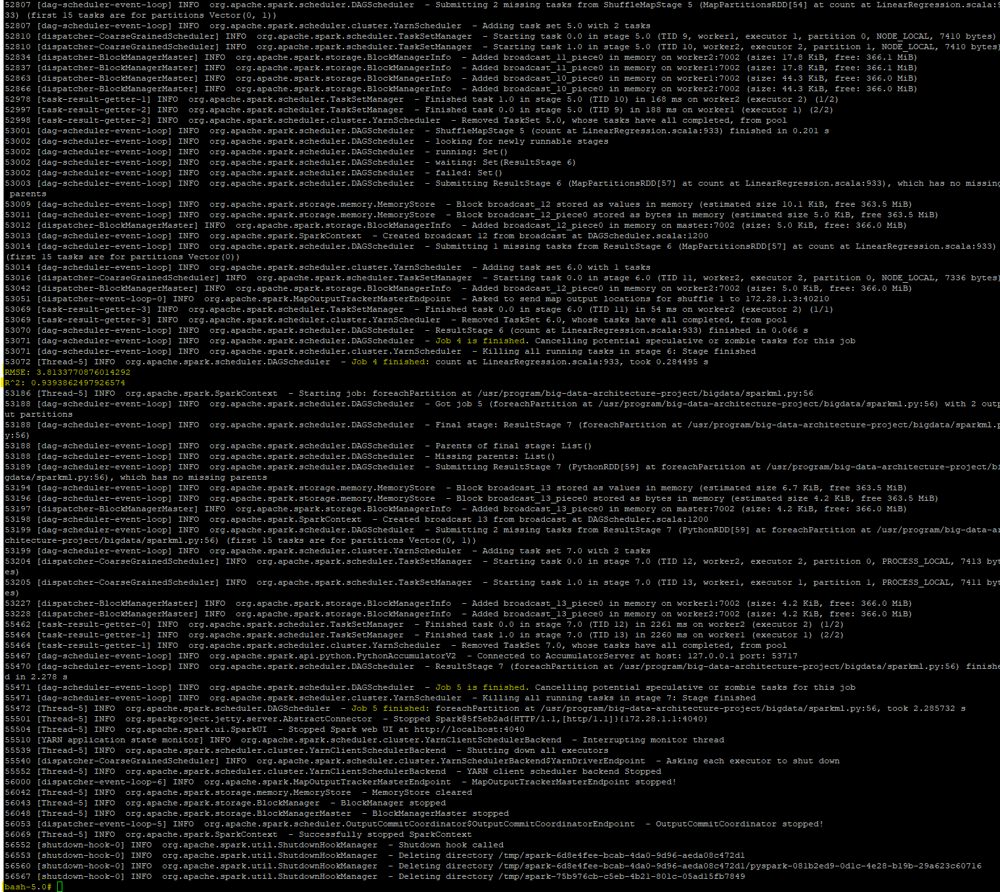
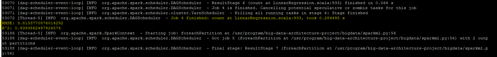
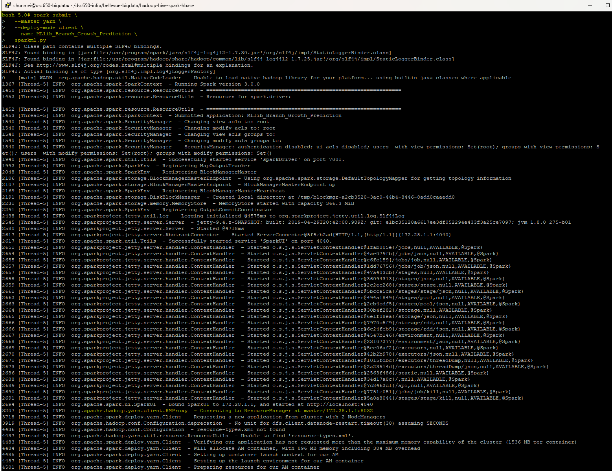

# Apache Spark MLlib — Distributed Machine Learning

## Role in the Pipeline

Apache Spark MLlib provides the distributed processing and machine learning layer for this project. The PySpark application reads project data from Hive, prepares the data for modeling, trains and evaluates a machine learning model, and generates model-performance metrics that are written into HBase.

## Hive Input

**Hive table:** `branch_growth`

Explain what data Spark reads from Hive and which fields are used by the machine learning workflow.

**Data Read from Hive**  

Spark executes the query SELECT Ad_Budget_K, New_Accnts_Opened FROM branch_growth to read branch advertising investments and account opening metrics directly from the Hive metastore into a Spark DataFrame (growth_df).  

**Fields Used in the Machine Learning Workflow**  

**Ad_Budget_K (Feature / Predictor Variable):** Represents the advertising budget allocated to a branch (in thousands of dollars). VectorAssembler processes it into a feature vector (features) to serve as the independent input variable ($X$).  
**New_Accnts_Opened (Target / Label Variable):** Represents the total number of new accounts opened at the branch. This is mapped as the target label ($Y$) that the LinearRegression model attempts to predict.  

## Data Preparation & Transformations

Describe the important preprocessing or transformation steps performed before model training.

Examples may include:

- selecting relevant features;
- handling missing values;
- encoding categorical fields;
- assembling feature vectors;
- scaling or normalization;
- creating training and test datasets.

**Data Cleaning & Missing Value Handling:** Rows with missing values are removed using growth_df.na.drop(). Additionally, VectorAssembler is configured with handleInvalid="skip" as a safeguard to bypass any null or invalid entries during feature construction, preventing runtime execution failures.  
**Feature Vectorization:** PySpark MLlib requires that numerical inputs be represented as dense or sparse vectors. The VectorAssembler consolidates the continuous predictor column Ad_Budget_K into a unified feature vector named features. The resulting DataFrame is then trimmed to include only the feature vector and the target variable New_Accnts_Opened.  
**Dataset Partitioning:** The transformed dataset is partitioned into training (70%) and testing (30%) subsets using randomSplit with a fixed pseudo-random seed (seed=42). Fixing the seed guarantees deterministic splits across execution runs, enabling reproducible model training and evaluation.  


## MLlib Algorithm

**Algorithm:** `Linear Regression`

Explain:

- Why this algorithm was appropriate for the selected dataset?  
  Linear Regression is appropriate for this dataset because the modeling objective seeks to analyze and quantify a direct continuous linear relationship between marketing expenditures and account growth. It provides a simple, highly interpretable baseline model without the risk of overfitting on small feature spaces.
  
- What prediction or modeling task it performs?  
  The algorithm performs a supervised continuous prediction (regression) task. It fits a linear mathematical equation to the training data to forecast the expected volume of new customer accounts based on historical advertising spend patterns.
- Which features and target/label are used?  
  Feature ($X$): Ad_Budget_K (assembled into the dense vector column features), representing the advertising budget allocation in thousands of dollars.  
  Target/Label ($Y$): New_Accnts_Opened (passed via labelCol), representing the total count of new accounts opened at a branch.  

## Training & Evaluation

Summarize the training process and explain the evaluation metric or metrics used.  

The training pipeline split the preprocessed data into a 70% training set and a 30% test set using a fixed random seed (seed=42). The LinearRegression algorithm evaluated the training set (train_data) to fit an optimal trendline by minimizing the sum of squared errors between predicted and actual account openings. Once fitted, the model predicted account volumes on the unseen test set (test_data), where performance was evaluated using RegressionEvaluator.

**Primary evaluation metric(s):** `R-Squared, Root Mean Squared Error `

Explain what the resulting values indicate about model performance.  

**High Predictive Accuracy ($R^2 \approx 93.94\%$):**  The $R^2$ score demonstrates that approximately 93.94% of the total variance in new accounts opened is directly explained by the advertising budget feature. This indicates an exceptionally strong linear correlation and fit.  
**Low Average Error ($\text{RMSE} \approx 3.81$):**  The RMSE indicates that on average, the model's predictions deviate from the actual count of new accounts opened by approximately 3.81 accounts, providing a narrow error margin suitable for branch decision-making and resource allocation.  


### Training Output



### Model Evaluation



## Spark Submit / YARN Execution

Document the exact `spark-submit` command used to submit the PySpark application through YARN.

```bash
# Paste your spark-submit command here
spark-submit \
  --master yarn \
  --deploy-mode client \
  --name MLlib_Branch_Growth_Prediction \
  sparkml.py

```

Briefly describe the successful execution and any important log or output information.



**Cluster Submission:** The application (sparkml.py) submitted cleanly to YARN (--master yarn), connecting to the ResourceManager (master:8032) and launching Application Master containers across 2 NodeManagers.  
**Metric Computation:** All DAG stages completed successfully, writing the calculated model performance metrics ($RMSE \approx 3.8134$, $R^2 \approx 0.9394$) directly to the log console.  


## HBase Output

List the model-performance metrics written by Spark into HBase and explain how the application connects the machine learning stage to the final persistence layer.

**Model-Performance Metrics Written to HBase**  
**R-Squared ($R^2$):** 0.9393862497926574 (stored in column cf:r2)  
**Root Mean Squared Error (RMSE):** 3.8133770876014292 (stored in column cf:rmse)  

**Connecting MLlib to the HBase Persistence Layer**  
1. **Evaluation Output Extraction:** Once the LinearRegression model computes predictions on the test dataset, the RegressionEvaluator calculates the scalar evaluation metrics ($R^2$ and $RMSE$) within the PySpark driver script.  
2. **DataFrame Structuring:** The metric values are formatted as key-value records (row_key: metrics1, cf:r2, cf:rmse) and converted into a distributed PySpark DataFrame or RDD.   
3. **Partition-Level Database Mutation:** The application calls a distributed foreachPartition action. Each Spark executor opens a client connection to HBase, instantiates batch Put operations containing the evaluated metric values, and writes them directly to the target branch_growth_metrics table over the network.  


**PySpark source files:** [`processing.py`](processing.py) and/or [`analysis.py`](analysis.py)
